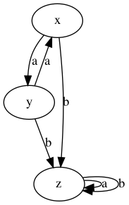
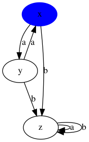
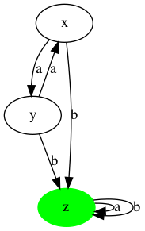
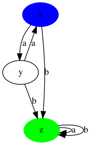

# PyFSA

A python CLI to render finite state graphs.

This application takes a CSV file with state information, and uses it to either produce the finite state graph, and verify that strings are valid given the state information, a start state, and a desired state. The `string` subcommand is also able to render the traversal graph of a string through the state machine.

Examples:

State file:
```csv
trigger,source,target
a,x,y
b,x,z
a,y,x
b,y,z
a,z,z
b,z,z
```

```bash
fsa state -f examples/states.csv
```




```bash
fsa state -f examples/states.csv -s x
```



```bash
fsa state -f examples/states.csv -e z
```



```bash
fsa state -f examples/states.csv -s x -e z
```


